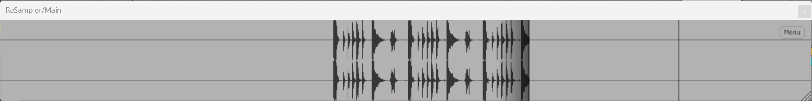
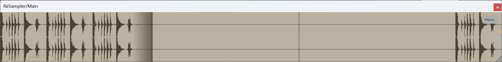
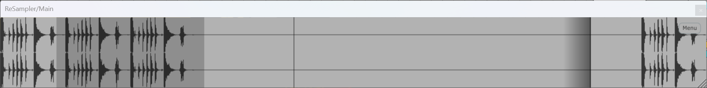
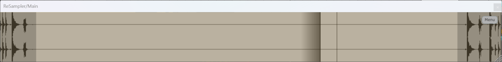
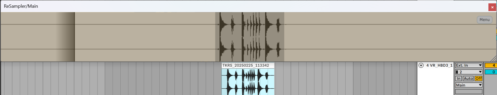
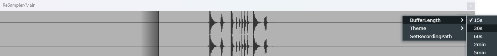
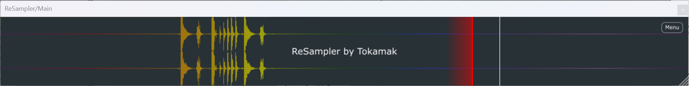
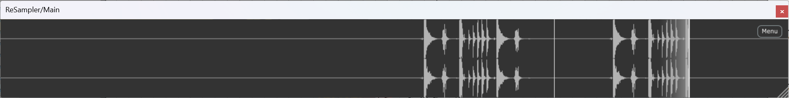
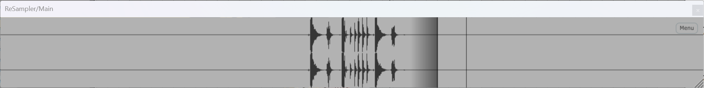
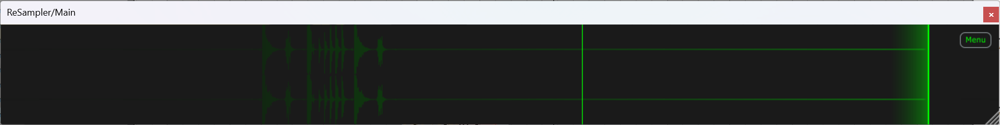

## ReSampler

### 基本信息
ReSampler是一个基于JUCE框架开发的循环采样工具，通过在堆区维护一个循环队列缓冲区来实现对过去一段时间内音频数据的记录，以避免频繁重采样产生的磁盘空间浪费。用户可以选择不同的缓冲区长度，也可以从任意位置播放缓冲区中的音频。用户可以选择任意长度的音频波形，并通过鼠标拖拽来创建音频文件。 

### 功能介绍及使用方法
- **对一定长度的声音信号进行循环采样并显示预览波形**
  ReSampler会对音频轨道上的历史播放数据进行记录，并提供音频缩略图。
  
- **暂停录制**
  在插件窗口内**双击鼠标左键**即可暂停录制。
  
- **创建/取消选区**
  在插件窗口内**左键拖动**即可选择区域，单击一次可以取消选区。拖拽选区可以将选区内的音频波形拖出为wav文件。
  
- **预览(播放)**
  **长按鼠标右键**即可从任意位置开始预览录制的音频数据，鼠标抬起停止播放。如果选区存在，**在选区之内单击右键**可以完整播放选区内容。
- **移动音频波形位置**
  **按下Ctrl+左键拖动**可以移动音频波形位置，此功能适用于需要选区的部分回绕至插件窗口最左端的情况，可以将该部分移动至插件窗口的中间并拖出。
- **调整缓冲区长度**
  见菜单的BufferLength项，提供了15s, 30s, 60s, 2min, 5min五个选项，默认为30s。
  
- **更改音频文件保存位置**
  见菜单的ReocrdingPath选项。

### 颜色主题
ReSampler提供了多个颜色主题：
**rainbow:**

**dark:**

**light:**

**matrix:**

### 注意事项
**ReSampler的图形界面显示和刷新对图形计算资源的占用较高，请尽量避免同时开始多个插件UI窗口！！！**
